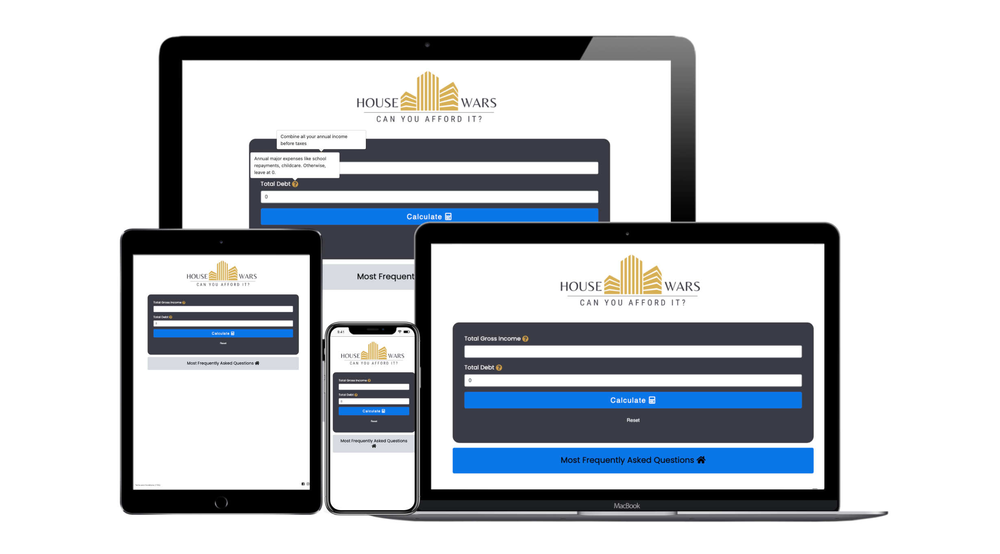
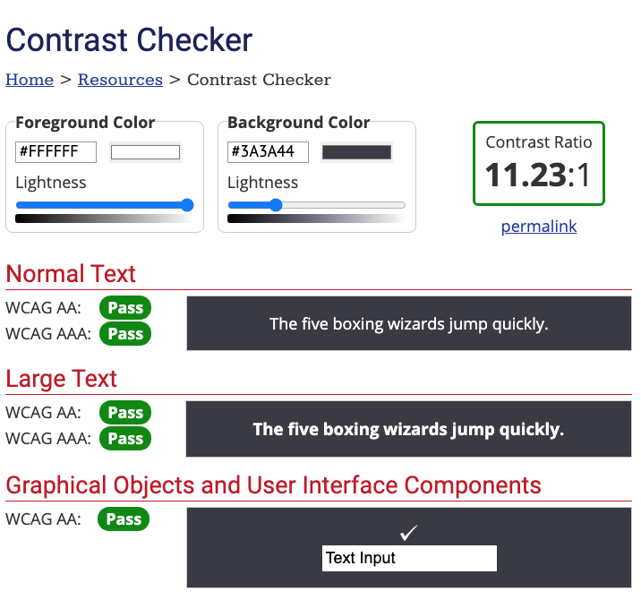
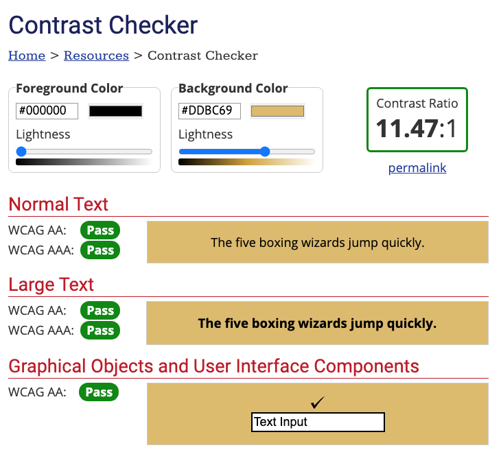
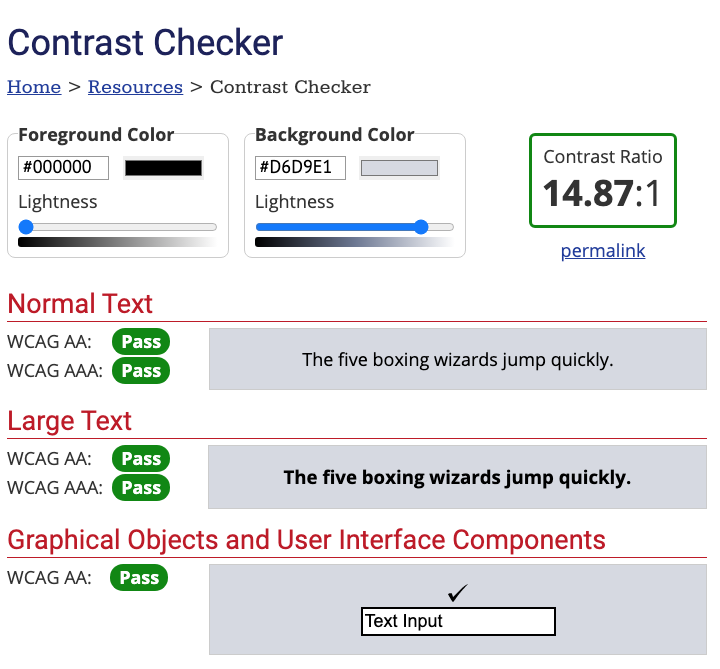
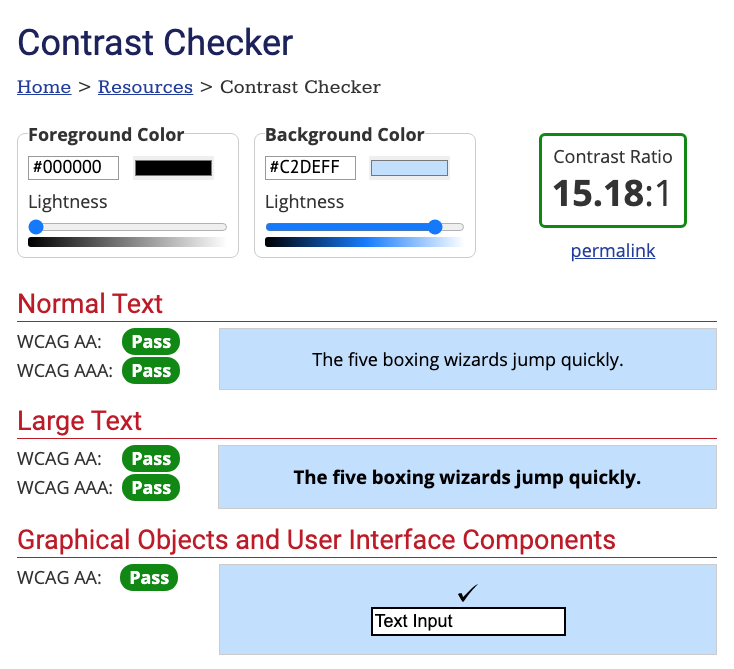
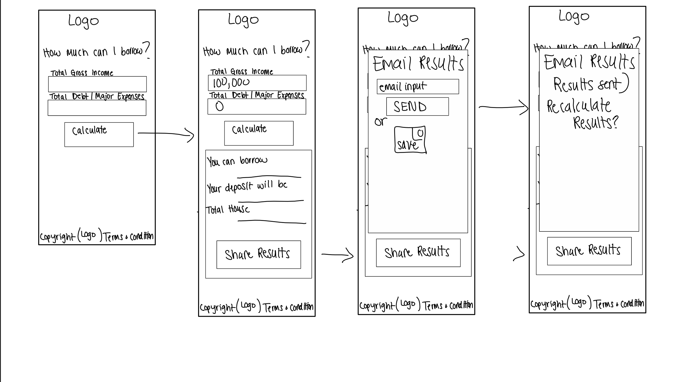
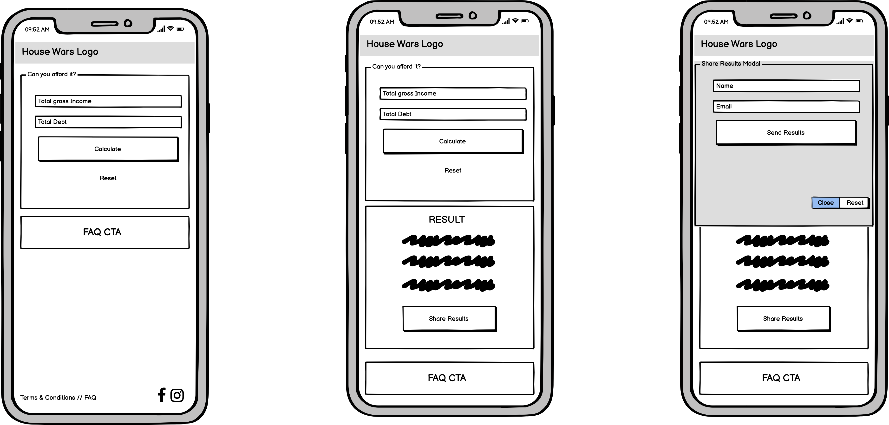
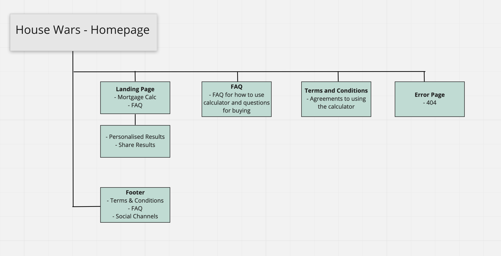

# Welcome to House Wars

---

## Code Institute: Milestone Project 2

    

---
## Table of Contents: 

- [What does it do and what does it need to fulfill?](#what-does-it-do-and-what-does-it-need-to-fulfill)
- [User Experience](#user-experience)
  - [User Stories](#user-stories)
  - [Design](#design)
    - [1. Font](#1-font)
    - [2. Color Scheme](#2-color-scheme)
    - [3. Logo](#3-logo)
    - [4. Wireframing & Proposed/Implemented Functionality per Page](#4-wireframing--proposedimplemented-functionality-per-page)
- [Technology Used](#technology-used)
- [Database](#database)
- [Features](#features)
  - [Future Features](#future-features)
- [Testing](#testing)
  - [Found Bugs & Fixes](#found-bugs--fixes)
- [Deployment](#deployment)
- [Credits](#credits)
  - [Special Thanks & Acknowledgements](#special-thanks--acknowledgements)

---

## What does it do and what does it need to fulfill?

The goal of House Wars is to create a calculator that won't ask a bunch of unnecessary questions just to get an idea of how much you can borrow and what the required deposit would be. As I begin my house hunting the oppressive reality of the Dublin housing market has made me want to create this. Just one less thing to enter to check what our buying power is. There are plenty of calculators out there but they ask so many questions like your date of birth, how many children you have etc. etc. For house searches just wanting to get a rough idea on how much they could potentially borrow with their income and the deposit House Wars is created with this need in mind.

House wars is created with mobile first in mind. You'll be able to quickly enter in your income and get a result on how much you can borrow along with the potential deposit you'll have to come up with which gives you your total buying power.

It is a clean design that is streamlined and to the point. A one page calculator where you can enter your basic details to get that rough mortgage buying power saving the user time and giving them the information quickly by creating a the best kind of user experience - the experience where it's so streamlined and free of any impediences. See more about design as we go into details on why we designed it the way we did.

This is my second of four Milestone Projects that are a part of the Full Stack Web Development Program at The Code Insitute. That requirements were to make a responsive application using HTML, CSS and Javascript.

[Click here to view the project live](https://maelou363.github.io/house_wars)

# User Experience:

## Main Objectives

* To create a seemless experience for the user. Created with mobile first in mind as majority of users will be 'on-the-go' when they are simply curious if they could afford a certain house or perhaps if their financial position changes. 
* Allow user to quickly be able to see results with just one click.
* From start to finish with as few clicks as possible to get user to the end of their journey.
* To allow user to save results so they don't have to continually go back to remember what the results were.
* To create a design that is responsive on all devices and screen sizes but with mobile first thinking.

## User Stories:

Current User:
* As a current user I want to be able to click once to see what my borrowing and buying power is so I can save time and spend time with family.
* As a current user I'd like to be able to save the results so I don't have to continue to go back and remember what the results were because it's hard to remember when so much is going on.
* As a current user I would like to send the results to myself or a family member so that we can discuss and see what our options are together.

New User:
* As a new user I would like to not be overwhelmed with questions that I am not used too so I can easily get my buying power.
* As a new user I'm not sure what counts as income so I would like to find out what does easily from one spot so that I can quickly get my result.
* As a new user I want to be able to easily navigate and be clear what I'm doing when and where within the site.

## Design

* I'm designing this with mobile first in mind. Which brings some things into play. When the user lands on the page they can access everything (no scrolling) to the income, expense, calculate and reset mobile in one spot. I want to design it to be visually clean and free from any impediences. 
* I want this to be a clean design. Visually appealing and the call to action obvious on what they need to do at each step.
* The design to be a smooth transition to the calculate and view results. With that in mind I implemented a few things like commas in the input and results so users can visually see what they are entering better, automatically entering 'O' for total debt/major expenses and making input fields numbers so when on mobile there is no need to for that extra click to make that change to the number keyboard.
* 

### 1. Font
- Headings - <a href="https://fonts.google.com/specimen/Poppins?preview.text_type=custom">Poppins</a>
- Body - <a href="https://fonts.google.com/specimen/Roboto+Condensed?preview.text_type=custom&query=robot">Roboto Condensed</a>

### 2. Colour Scheme

Our colour scheme was created with a goal of a colour palette that would portray sophisticated elegance. Using navy blue as our stand out colour and our gold for accent. We chose colours that would all be AA compliant at mininum but ended up finding a scheme that made them all AAA compliant
 
-  `#3A3A44` - Primary colour
-  `#DDBC69` - Secondary colour
-  `#D6D9E1` - Supplementary colour
-  `#C2DEFF` - Supplementary colour 2

 Colour Scheme AAA Compliant Verification 

    

    

    

    

### 3. Logo

    

### 4. Wireframing & Proposed/Implemented Functionality per Page

Wireframes for this project were created using Affinity Design to sketch my general ideas out and then Balsamiq to get a more solid vision. Each element was structurally planned out before building the project to be sure all elements were accounted for and worked together.

#### Wireframes

    

    

### Structure

Our information architecture to demonstrate the flow and key aspects of function throughout the site.

    

[Back to Top](#table-of-contents)

# Technology Used

## Languages, Frameworks, Editors & Version Control:

* HTML5/CSS3/Javascript - core languages used to build this site.
* Bootstrap Framework - Pure CSS Component Frontend framework for layout and overall fronend architecture.
* Google Fonts - used to import the fonts "Poppins" and "Roboto+Condensed" into the style.css file.
* JQuery - Open source javascript library design to simplify HTML DOM tree manipulation and event handling.
* VSCode/Gitpod - preferred used editors/IDEs to develop the project.
* Git - installed on local machines or default built into Gitpod.
* Github - used to host the repository and version control the site, aswell as used for deployment of the project.

## Tools Used:

* [W3C Markup Validation Service](https://validator.w3.org/) - Used to check the validity and efficiency of the HTML and CSS code base.
* [JSHint](https://jshint.com/) - Used to check validity of javascript code
* [Font Awesome](https://fontawesome.com/) - For iconography added to the site.
* [Balsamiq](https://balsamiq.com/) - Used to create the wireframes.
* [TinyPNG](tinypng.com) - Used to compress images used throughout the site without affecting image integrity/quality.
* [W3C Schools](https://www.w3schools.com/) - Used several times whislt building the project and used code snippet for the contact.html form section
* [Am I Responsive](http://ami.responsivedesign.is/) - Tool to double check the responsiveness of application
* [WebAIM](https://webaim.org/resources/contrastchecker/) - Contrast checker to make sure that colours are AA compliant at least. We made sure that our colours were all AAA compliant.

# Features

[Back to Top](#table-of-contents)

#### Design Features

House wars was design with loads of UI in mind. Every section of the application was design to create a smooth user experience.
 * The header contains a simple logo at the top in the center of the page which also acts as the navigation when clicked will take you back to the homepage. There really is only one other page FAQ and I made the decision to omit a navigation bar in this design. And instead have a CTA to the FAQ straight below the calculator should a new user enter the application and have additional questions before using. This CTA conveniently is shown on all screen sizes when loading application which fits with our design goals of a one-stop-shop without scrolling.
 * The footer also contain social media icons along with terms/conditions page and FAQ page as well to have another option for navigation of the site.

 ## Home
  The Home Page is a clean UI with one column wide on mobile, tablet and computer devices. This application was designed with mobile first so it works on desktop still but from a design standpoint it's created for mobile.
  * **Calculator** - Occupying almost 90% of the viewing on a mobile. This layout was choosen as to allow the user to simply add inputs and calculate. There are several UI features involved in this design.
    * Automatically putting Total Debt input at '0' to allow user who has no debt to not have to enter in. But if clicked, automatically does remove the 'O' and user can enter in their data.
    * Reset Button that allows user to remove prior inputs and when reset is clicked will autofocus back into 'Total Gross Income' input.
      #### Calculator Feedback
      * For visual reasons we added commas into the numbers as the user is typing in the number. Allowing the user the ability to have clear feedback on what they have entered.
      * Autofocus on the first input field (Total Gross Income) which if using on desktop requires so clicking but from a UX perspective we didn't want the keyboard showing up immediately so they will have to click the input upon entering the site. We did create a feature where if they click 'reset' buttons it will autofocus back to the total gross income and allow them enter in a new number automatically.
      * Question Popovers - next to our input labels we have more information that can be displayed should user have questions about what should be counted.
  * **FAQ Section** - Occupying around 10% of the viewing on mobile over 375 allows users to see that they have an option
  * **Results Page** - Hidden initially until user clicks 'calculate' Which then will slow scroll automatically to the results page.
  * **Send Results**  - Modal popup to send results

#### Future Features:

* Create a future feature where once established how much you can borrow to bring up properties within that price range. 
* To create a feature that allows First Time Homebuyers to click so it calculates a 10% down deposit.

# Testing

* In testing and thinking of the final flow of application is when it occured to me that I'd like to give the user the option to access a navigation menu. This led me to intially begin building a navbar but what I decided was to create a FAQ below our calculator that takes up just 10% of the 
* FAQ button was not entirely clickable. Only if the area directly around the text. I added an onclick in the div surrounding the button to allow that entire area to be clickable.
* 

## Testing Responsiveness
Manually tested the live project using google developer tools to view the project on different screen sizes. 
Used multiple devices and feedback from family who went to the deployed site on their devices.

## Found Bugs & Fixes:
* When hitting the reset button it does not clear the results - only clears the inputs entered.
* Adding commas to the input fields created a problem with our calculations. We ended up having to remove the type="number" from the input field to work with our Jquery but then was concerned from a UI standpoint that they would have to click another time to access the proper number keyboard. Our work around was type="tel" that allowed the calculations to properly calculate but still worked with our function.
*  When not entering values in input field you will be alerted to add values. When this happens it resets the results section which would show previous calculations or a blank result section. Fixed bug by making sure it hides the result section upon this alert.
* In Share Results form after clicking to close and reset to recalculate the UI 'message sent' does not reset. Fixed this by adding a innerText change within the resetValue function.
* EmailJS email template stopped sending results and just sending a blank email. We console logged values to confirm they were populating and they were. We confirmed on EmailJS EmailHistory that values were getting delivered. Ended up being that simply changing the color and font of the email template is what causes this bug. The fix was to make the email template plain.... unfortunately... 
* 'submit' Event Listener is firing on the FAQ button that is not connected - fix was to remove the javascript import off of faq.html page.

[Back to Top](#table-of-contents)

# Deployment

This website was developed in multiple editors, Gitpod and vsCode, and version controlling was utilised via local (git) and online (github) repository technologies.

Deploying this application was achieved through Github pages by:

* Selecting the Repository from my list in the Github Dashboard.
* Navigating to "Settings" and to the "Github Pages" section.
* From the "Source" section, click on the dropdown and select "main" branch from the associated list.
* Once "main" branch is selected, the page will auto-refresh and navigate the user to the top of the page with a visual ribbon display detailing, "Github pages source saved", indicating the success of the deployment.
* The link to the website can then be found under the "Github Pages" section, with a ribbon notification stating:
    "Your site is published at "https://<username>.github.io/<repo-name>/"

To clone the website:

Select the Repository from the Github Dashboard.
* Click on the "Clone or download" green button located above and to the right of the "Add file" button.
* Click on the "clipboard icon" to the right of the Git URL to copy the web URL of the Clone.
* Open your preferred editor/IDE and navigate to the terminal window.
* Type `git clone <paste-clone-url-here>` and press "Enter/Return" on your keyboard.
* This will create a clone of the project for you.

## Credits / Acknowledgements

# Content / Media
*

# Acknowledgements
Thank you to everyone who have helped with support, inspiration and guidance at different stages of the project. 

[Back to Top](#table-of-contents)
