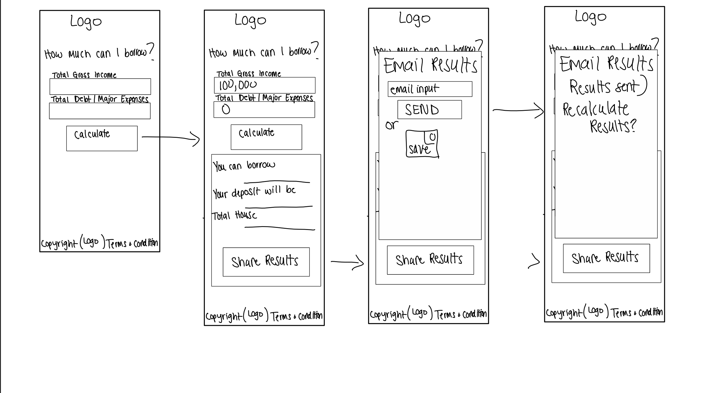

# Welcome to House Wars

---

## Code Institute: Milestone Project 2

    

---
## Table of Contents: 

- [What does it do and what does it need to fulfill?](#what-does-it-do-and-what-does-it-need-to-fulfill)
- [User Experience](#user-experience)
  - [User Stories](#user-stories)
  - [Design](#design)
    - [1. Font](#1-font)
    - [2. Color Scheme](#2-color-scheme)
    - [3. Logo](#3-logo)
    - [4. Wireframing & Proposed/Implemented Functionality per Page](#4-wireframing--proposedimplemented-functionality-per-page)
- [Technology Used](#technology-used)
- [Database](#database)
- [Features](#features)
  - [Future Features](#future-features)
- [Testing](#testing)
  - [Found Bugs & Fixes](#found-bugs--fixes)
- [Deployment](#deployment)
- [Credits](#credits)
  - [Special Thanks & Acknowledgements](#special-thanks--acknowledgements)

---

## What does it do and what does it need to fulfill?

The goal of House Wars is to create a calculator that won't ask a bunch of unnecessary questions just to get an idea of how much you can borrow and required deposit. As I begin my house hunting and opressive reality of the Dublin housing market as made me want to create this. Just one less thing to worry about. There are plenty of calculators out there but they ask questions like your date of birth, how many children you have etc. For house searches just wanting to get a rough idea on how much they could potentially borrow and the deposit House Wars is created with this need in mind.

House wars is created with mobile first in mind. You'll be able to quickly enter in your income and get a result on how much you can borrow along with the potentially deposit you'll have to come up with. 

It's clean design that is streamlined and to the point. One page calculator where you can enter your basic details to get that rough mortgage buying power saving the user time and giving them the information quickly.

This was my second of four Milestone Projects that are a part of the Full Stack Web Development Program at The Code Insitute. That requirements were to make a responsive application using HTML, CSS and Javascript.

[Click here to view the project live](https://maelou363.github.io/house_wars)

# User Experience:

## Main Objectives

* To create a seemless experience for the user. Created with mobile first in mind as majority of users will be 'on-the-go' when they are simply curious if they could afford a certain house or perhaps if their financial position changes. 
* Allow user to quickly be able to see results with just one click.
* To allow user to save results so they don't have to continually go back to remember what the results were.
* To create a design that is responsive on all devices and screen sizes but with mobile first thinking.

## User Stories:

_User:_
* As a user I want to be able to click once to see what my borrowing and buying power is.
* As a user I'd like to be able to save the results so I don't have to continue to go back and remember what the results were.
* 

# Design

* 
* 
* 
* 

### 1. Font
- Headings - <a href="https://fonts.google.com/specimen/Oswald?preview.text_type=custom">Oswald</a>
- Body - <a href="https://fonts.google.com/specimen/Poppins?preview.text_type=custom">Poppins</a>

### 2. Color Scheme

Our color scheme was created to create a little bit of colour but muted colour scheme around the photos and portfolio work to really give the photos the opportunity to shine and showcase companies work.

-  `#3A3A44` - Primary color
-  `#C08E31` - Secondary color
-  `#D6D9E1` - Supplementary color

### 3. Logo

    

## 4. Wireframing & Proposed/Implemented Functionality per Page

Wireframes for this project were created using Affinity Design and Sketch for both mobile and desktop. Each element was structurally planned out before building the project to be sure all elements were accounted for and worked together.

Wireframes

    

[Back to Top](#table-of-contents)

# Technology Used

## Languages, Frameworks, Editors & Version Control:

* HTML/CSS ~ core languages used to build this site.
* Bootstrap Framework ~ Pure CSS Component Frontend framework for layout and overall fronend architecture.
* VSCode/Gitpod ~ preferred used editors/IDEs to develop the project.
* Git ~ installed on local machines or default built into Gitpod.
* Github ~ used to host the repository and version control the site, aswell as used for deployment of the project.

## Tools Used:

* [W3C Markup Validation Service](https://validator.w3.org/) - Used to check the validity and efficiency of the code base.
* [Font Awesome](https://fontawesome.com/) - For iconography not custom to the site.
* Sketch - Used to create the wireframes.
* [TinyPNG](tinypng.com) - Used to compress images used throughout the site without affecting image integrity/quality.
* [W3C Schools](https://www.w3schools.com/) - Used several times whislt building the project and used code snippet for the contact.html form section
* [CSSScript.com](https://www.cssscript.com/create-responsive-tabs-component-using-css-radio-input/) - Used for our dynamic tabs on index.html

# Features

[Back to Top](#table-of-contents)

#### Future Features:

* I'd like to create a future feature where once established how much you can borrow to bring up properties within that price range. 
* To create a feature that allows First Time Homebuyers to click so it calculates a 10% down deposit.
* 
* 

# Testing

* 
* 
* 

## Testing Responsiveness
Manually tested the live project using google developer tools to view the project on different screen sizes. 
Used multiple devices and feedback from family who went to the deployed site on their devices.

## Found Bugs & Fixes:
* 
* 
* 
* 
* 

[Back to Top](#table-of-contents)

# Deployment

This website was developed in multiple editors, Gitpod and vsCode, and version controlling was utilised via local (git) and online (github) repository technologies.

Deploying this application was achieved through Github pages by:

* Selecting the Repository from my list in the Github Dashboard.
* Navigating to "Settings" and to the "Github Pages" section.
* From the "Source" section, click on the dropdown and select "main" branch from the associated list.
* Once "main" branch is selected, the page will auto-refresh and navigate the user to the top of the page with a visual ribbon display detailing, "Github pages source saved", indicating the success of the deployment.
* The link to the website can then be found under the "Github Pages" section, with a ribbon notification stating:
    "Your site is published at "https://<username>.github.io/<repo-name>/"

To clone the website:

Select the Repository from the Github Dashboard.
* Click on the "Clone or download" green button located above and to the right of the "Add file" button.
* Click on the "clipboard icon" to the right of the Git URL to copy the web URL of the Clone.
* Open your preferred editor/IDE and navigate to the terminal window.
* Type `git clone <paste-clone-url-here>` and press "Enter/Return" on your keyboard.
* This will create a clone of the project for you.

## Credits / Acknowledgements

# Content / Media
* All photos used on this website were created by either myself or my friend Katie Chase from The Foodie Movement.

# Acknowledgements
Thank you to everyone who have helped with support, inspiration and guidance at different stages of the project. 

[Back to Top](#table-of-contents)# house_wars
